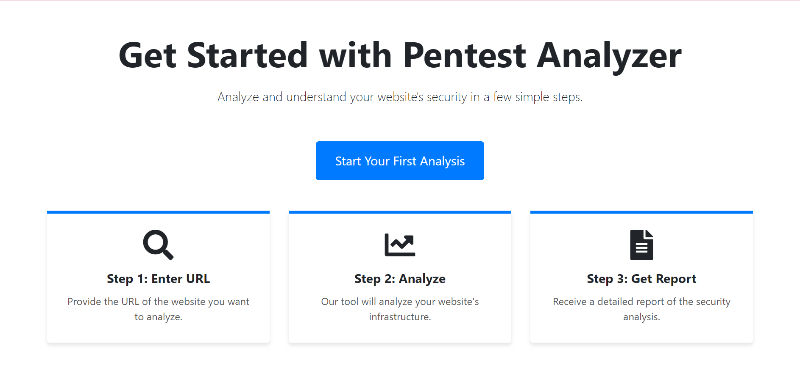
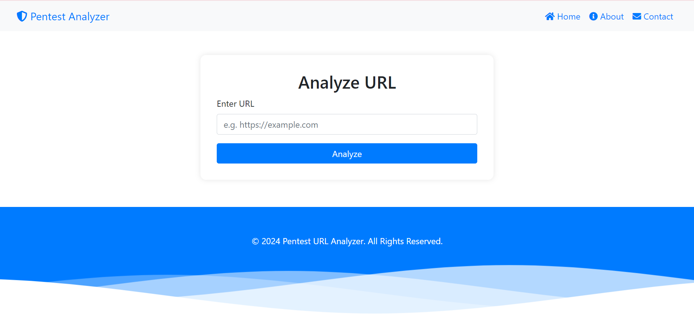
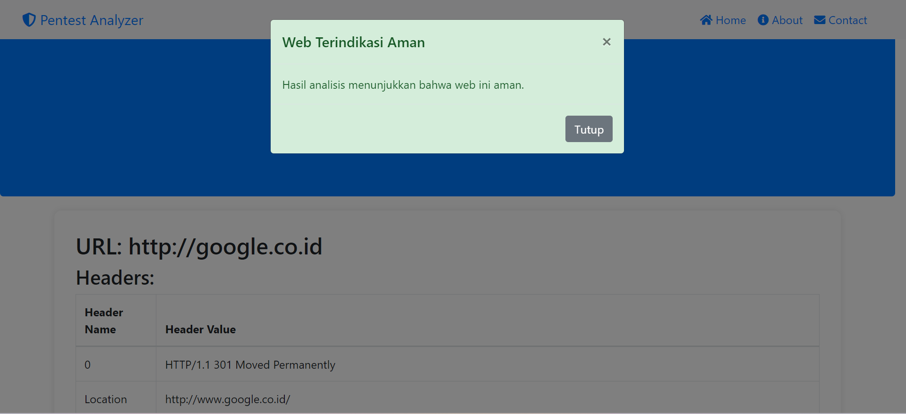

# Pentest URL Analyzer

**Pentest URL Analyzer** is a comprehensive tool designed for in-depth infrastructure and security analysis of URLs. It leverages multiple APIs to provide detailed information about web servers, domain registrations, geolocation, SSL certificates, and potential vulnerabilities.

## Table of Contents

- [Features](#features)
- [Installation](#installation)
- [Usage](#usage)
- [Screenshots](#screenshots)
- [Credits](#credits)
- [License](#license)

## Features

- **Shodan Integration**: Retrieves data on services, ports, and potential vulnerabilities.
- **Whois Information**: Provides domain registration details.
- **GeoIP**: Locates the physical position of servers.
- **SSL/TLS Information**: Checks SSL certificate details and validity.
- **Reverse DNS**: Resolves IP addresses to domain names.
- **Threat Intelligence**: Evaluates URL reputation and potential threats.

## Installation

Follow these steps to set up the project locally:

1. **Clone the repository:**

    ```sh
    git clone https://github.com/Charelas/212310041-UAS-PWL
    cd pentest-app
    ```

2. **Install dependencies:**

    ```sh
    composer install
    npm install
    ```

3. **Environment setup:**

    - Copy the `.env.example` to `.env`:

        ```sh
        cp .env.example .env
        ```

    - Update the `.env` file with your database credentials and API keys for Shodan, WhoisXML API, and other services.

4. **Generate application key:**

    ```sh
    php artisan key:generate
    ```

5. **Run migrations:**

    ```sh
    php artisan migrate
    ```

6. **Serve the application:**

    ```sh
    php artisan serve
    ```

    The application will be accessible at `http://localhost:8000`.

## Usage

- **Analyze URL**: Enter the URL you want to analyze, and the application will fetch detailed information from multiple sources.
- **Export Results**: Export the analysis results as a PDF document.

## Screenshots







## Credits

This project utilizes several amazing libraries and services:

- [Laravel](https://laravel.com/)
- [Bootstrap](https://getbootstrap.com/)
- [Shodan API](https://www.shodan.io/)
- [WhoisXML API](https://www.whoisxmlapi.com/)
- [GeoIP](https://www.maxmind.com/en/geoip2-services-and-databases)

## License

This project is licensed under the MIT License. See the [LICENSE](LICENSE) file for details.
